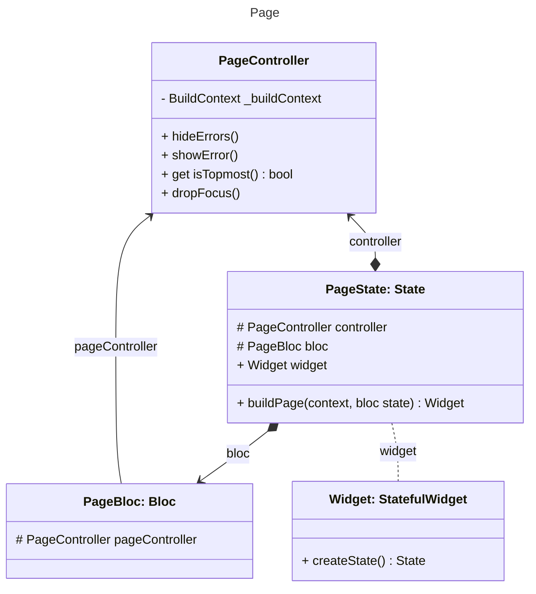

```mermaid


---
title: Page
---

classDiagram
    PageController <-- Bloc: pageController
    PageController <--* State: controller
    State *--> Bloc : bloc
    State .. Widget : widget

 
    class PageController {
        - BuildContext _buildContext
        + hideErrors()
        + showError()
        + get isTopmost() bool
        + dropFocus()
    }

    class Bloc["PageBloc: Bloc"] {
       # PageController pageController
    }

    class State["PageState: State"] {
        # PageController controller
        # PageBloc bloc
        + Widget widget
        + buildPage(context, bloc state) Widget
    }

    class Widget["Widget: StatefulWidget"] {
       + createState() State
    } 

```